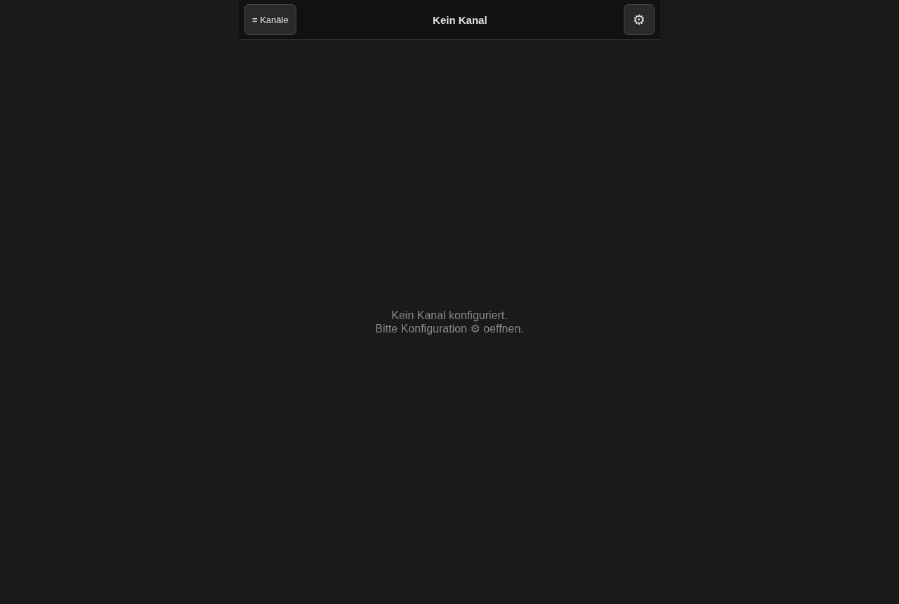
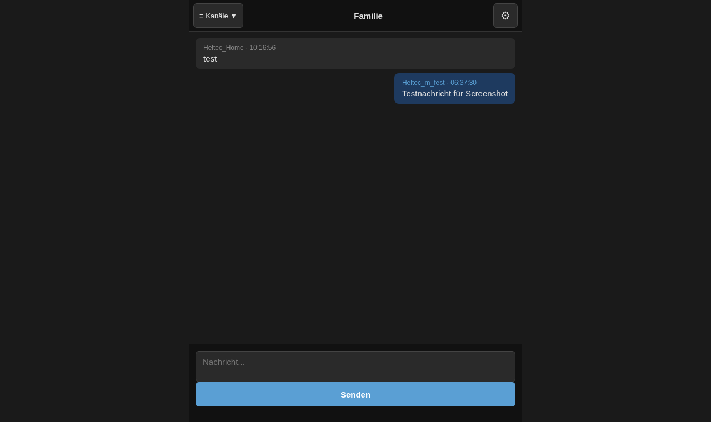
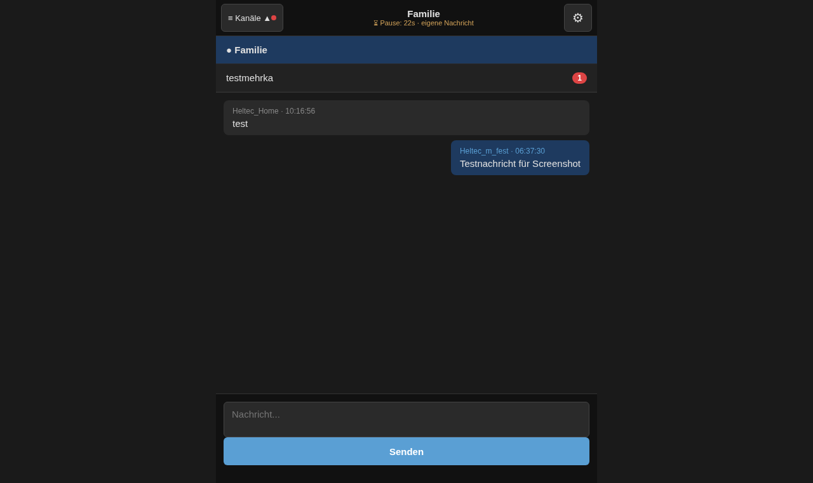
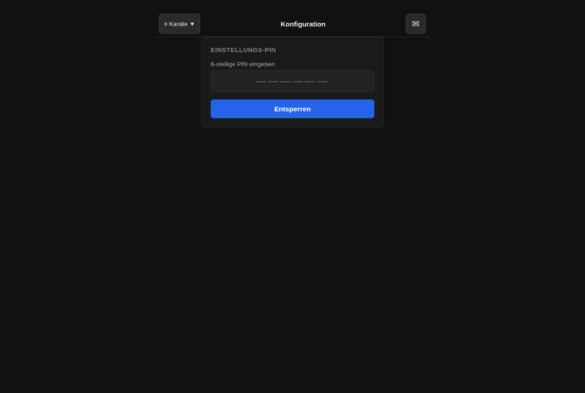
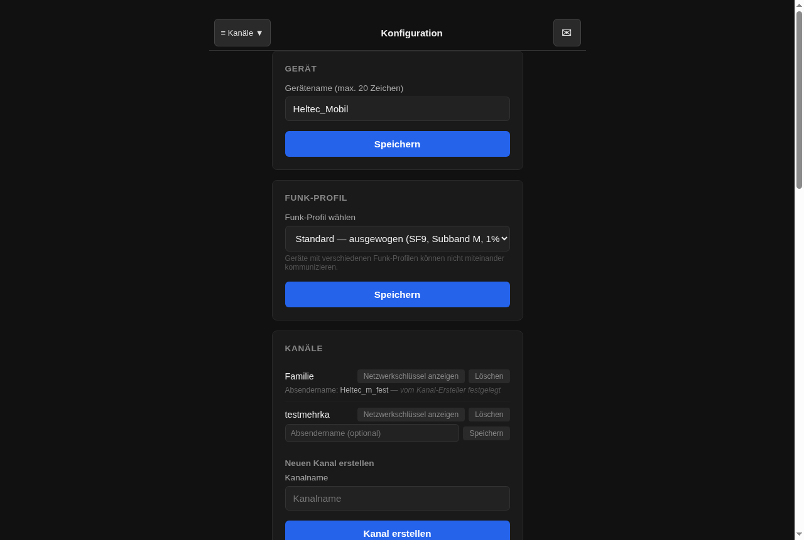
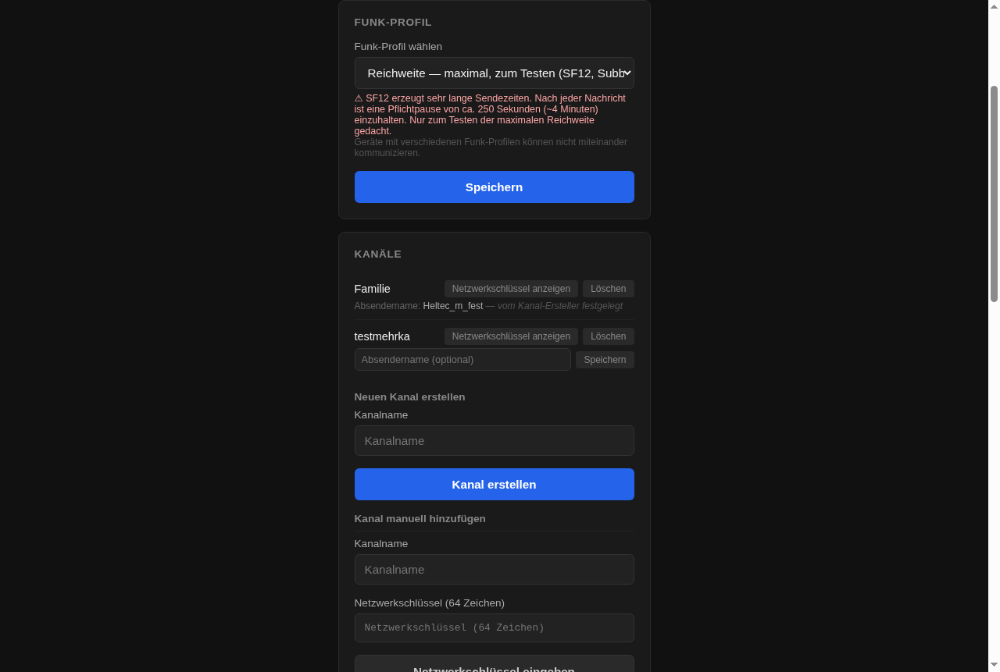
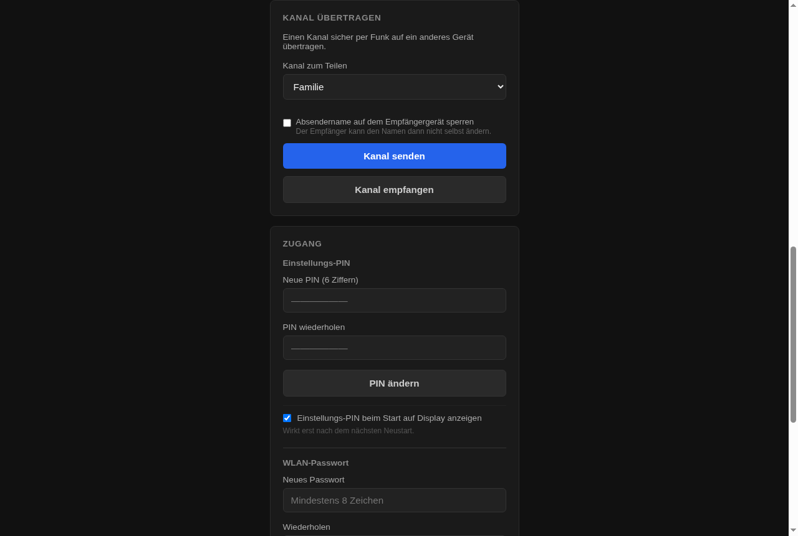
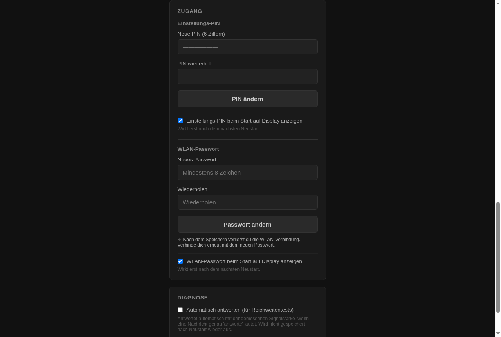
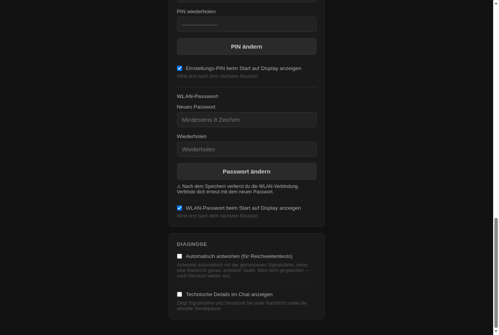
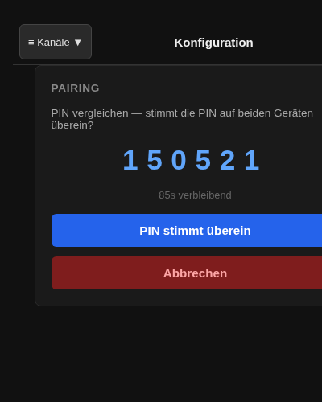

# ProjektX — Bedienungsanleitung

*Gerät nach dem Ponsal-Protokoll · Stand 2026-07-09*

*Hintergründe zu LoRa, Mesh-Funktion, Duty Cycle und Funk-Profilen:
[Hintergrund — wie ProjektX funktioniert](hintergrund.html)*

---

## Was ist ProjektX

ProjektX ist ein Kommunikationsgerät, das ohne Internet und ohne Mobilfunk
funktioniert. Es setzt das Ponsal-Protokoll um. Ein Gerät pro Haushalt
reicht. Verbindung per WLAN, Chat über den Browser.

**Kein Aufkleber, keine App, kein Konto.**

---

## Auspacken und erster Start

Gerät per USB-C mit Strom versorgen. Das Display durchläuft danach 60
Sekunden lang drei Bildschirme, je 5 Sekunden, mehrfach wiederholt:

```
WLAN verbinden:
ProjektX-A3F2
PW:4F9A2B7E
```
→
```
Einstellungs-
PIN:
384021
```
→
```
Browser oeffnen:
192.168.4.1
```

Mit dem angezeigten WLAN verbinden, danach öffnet der Browser automatisch
den Chat. Falls nicht: `192.168.4.1` manuell eingeben.

WLAN-Passwort und PIN sind **zufällig generiert bei Erstinbetriebnahme** —
nicht auf einem Aufkleber, nur auf dem Display. Nach jedem Werksreset ändern
sich beide erneut. Beide Anzeigen lassen sich in der Konfiguration
abschalten (Karte "Zugang", siehe unten) — dann steht dort stattdessen
"ausgeblendet, siehe config.html".

---

## Die Chat-Oberfläche

Öffnet sich automatisch beim Verbinden, ohne PIN-Eingabe.

**Ohne eingerichteten Kanal:**



**Mit Nachrichten — eigene rechts (blau), fremde links (grau):**



**Obere Leiste:**
- Links: "≡ Kanäle" — öffnet die Kanalliste darunter. Ein roter Punkt neben
  dem Pfeil bedeutet: mindestens ein anderer Kanal hat ungelesene
  Nachrichten
- Mitte: Name des gerade geöffneten Kanals; läuft gerade die Sendepause,
  erscheint darunter zusätzlich "⏳ Pause: Xs"
- Rechts: Zahnrad ⚙ — führt zur Konfigurationsoberfläche

**Kanalliste geöffnet, ein Kanal mit ungelesenen Nachrichten:**



Der aktive Kanal ist blau markiert. Andere Kanäle mit ungelesenen
Nachrichten zeigen die Anzahl in Rot rechts daneben. Tippen wechselt den
Kanal.

**Eingabefeld:** Text eintippen, mit Enter oder "Senden" abschicken
(Umschalt+Enter für einen Zeilenumbruch ohne Absenden, maximal 182
Zeichen). Nach dem Absenden wird das Feld sofort geleert — die eigene
Nachricht selbst erscheint erst mit der nächsten automatischen
Aktualisierung (maximal 2 Sekunden später) in der Liste, das ist normal.

**Falls unterhalb des Eingabefelds ein roter Hinweistext erscheint:**

| Text | Bedeutung |
|---|---|
| "Kein Kanal" | Erst einen Kanal einrichten (siehe unten) |
| "Vorherige Nachricht noch nicht abgeschlossen" / "Kanal belegt" | Kurz warten, wird automatisch erneut versucht |
| "Verbindungsfehler" | WLAN-Verbindung zum Gerät prüfen |
| "Senden fehlgeschlagen" | Erneut versuchen |

**Wenn eine Nachricht nicht sofort ankommt:** Kann vorkommen, wenn das
Gerät gerade wegen der Sendepause (Duty Cycle) kurz nicht senden darf —
der "Senden"-Button bleibt trotzdem nutzbar, die Nachricht wird
automatisch nachgeholt, sobald die Pause vorbei ist. Kein erneutes
Abschicken nötig.

---

## Die Konfigurationsoberfläche (config.html)

Erreichbar über das Zahnrad ⚙ oben rechts im Chat. Verlangt die 6-stellige
Einstellungs-PIN vom Display:



Für den täglichen Gebrauch **nicht nötig** — nur zum Einrichten oder
nachträglichen Ändern. Zurück zum Chat über das Briefumschlag-Symbol ✉
oben rechts. Sechs Karten, in dieser Reihenfolge:

### 1. Gerät · 2. Funk-Profil · 3. Kanäle



**Gerät** — Gerätename eintragen (max. 20 Zeichen). Das ist der Name, unter
dem eigene Nachrichten erscheinen, sofern kein kanalspezifischer
Absendername gesetzt ist.

**Funk-Profil** — Dropdown mit vier Profilen (Standard, Reichweite,
Organisation, Schnelle Nachrichten). **Wichtig:** Vor dem Speichern
erscheint jetzt eine Sicherheitsabfrage, weil sich Geräte mit
unterschiedlichem Profil danach nicht mehr erreichen können. Bei
"Reichweite" zusätzlich ein Warnhinweis zur rund 4-minütigen Pflichtpause
nach jeder Nachricht:



**Kanäle** — Liste aller eingerichteten Kanäle (max. 8). Pro Kanal:
- "Netzwerkschlüssel anzeigen" — fragt zuerst extra nach ("Der
  Netzwerkschlüssel gibt Zugang zu allen Nachrichten in diesem Kanal — nur
  anzeigen wenn nötig"), zeigt ihn danach mit Kopieren-Button
- "Löschen" — fragt vor dem Löschen extra nach, danach unwiderruflich
- Feld "Absendername (optional)" — eigener Name nur für diesen Kanal. Ist
  der Kanal per Pairing mit gesperrtem Namen empfangen worden, steht dort
  stattdessen ein grauer Hinweistext ("… vom Kanal-Ersteller festgelegt")
  statt eines Eingabefelds

  Darunter: "Neuen Kanal erstellen" (Name, Schlüssel wird automatisch
  generiert) sowie "Kanal manuell hinzufügen" (Name + fertiger
  64-stelliger Netzwerkschlüssel von Hand eintragen).

### 4. Kanal übertragen · 5. Zugang



**Kanal übertragen** — Pairing mit einem weiteren Gerät, siehe eigener
Abschnitt unten.

**Zugang** — Einstellungs-PIN ändern und WLAN-Passwort ändern, jeweils mit
eigenem Anzeige-Toggle direkt darunter:



Achtung beim WLAN-Passwort: **Nach dem Speichern trennt sich die
WLAN-Verbindung sofort** — mit dem neuen Passwort erneut verbinden.

### 6. Diagnose



**Automatisch antworten (für Reichweitentests)** — aktiviert, antwortet
das Gerät auf Nachrichten, die genau "antworte" lauten, mit der gemessenen
Signalstärke. Praktisch, um beim Aufstellen zweier Geräte zu prüfen, ob die
Verbindung trägt. Wird nicht dauerhaft gespeichert, nach einem Neustart
wieder aus.

**Technische Details im Chat anzeigen** — zeigt danach im Chat unter jeder
Nachricht Signalstärke, Sendezeit und die aktuelle Sendepause. Wirkt nur im
eigenen Browser, verändert nichts am Gerät selbst.

---

## Ein Familiennetz einrichten (erstes Gerät)

1. Konfiguration öffnen → PIN eingeben.
2. Karte "Kanäle" → "Neuen Kanal erstellen" → Namen vergeben, z. B.
   *Familie*.
3. Karte "Funk-Profil" → Standard ist voreingestellt und für die meisten
   Fälle passend.
4. Karte "Gerät" → eigenen Namen eingeben, z. B. *Papa*.

Dieses Gerät ist jetzt fertig eingerichtet.

---

## Weitere Geräte demselben Netz hinzufügen (Pairing)

**Gebergerät** (hat den Kanal bereits) — Karte "Kanal übertragen":
1. Kanal auswählen
2. Optional: Checkbox "Absendername auf dem Empfängergerät sperren"
3. "Kanal senden"

**Nehmergerät** (soll den Kanal bekommen):
1. Entweder Taster 3 Sekunden gedrückt halten — Display zeigt währenddessen
   "Pairing / Loslassen zum / Starten", beim Loslassen startet der
   Empfangsmodus — **oder** in der Konfigoberfläche "Kanal empfangen"
   auswählen

**Beide Geräte** berechnen aus dem Schlüsselaustausch dieselbe 6-stellige
PIN. Am Gebergerät sieht das im Browser so aus:



1. **PINs auf beiden Geräten vergleichen.** Stimmen sie überein, am
   Gebergerät auf "PIN stimmt überein" tippen — das Nehmergerät muss die
   PIN nur ablesen, dort gibt es keinen eigenen Bestätigungsbutton
2. Übertragung läuft automatisch weiter: Netzwerkschlüssel, dann Name
   (inkl. Sperr-Status), jeweils mit Bestätigung durch das Nehmergerät
3. Am Nehmergerät: Namen für den neuen Kanaleintrag vergeben, falls nicht
   bereits durch das Gebergerät fest vorgegeben
4. Gebergerät zeigt "Pairing erfolgreich"

**Pairing fügt immer hinzu — bestehende Kanäle gehen dabei nie verloren.**
Falls der Kanalname am Nehmergerät bereits existiert, wird vor dem
Abschluss ein Umbenennen verlangt. Das Funk-Profil wird **nicht**
mitübertragen — am Nehmergerät separat prüfen/einstellen.

**Wenn etwas schiefgeht:** Am häufigsten passiert das hier — ein Gerät
wartet allein, weil die Gegenstelle nicht im Pairing-Modus ist. Nach 3
Minuten erscheint:

> Pairing abgebrochen — kein Gerät gefunden.
> Mögliche Ursachen:
> • Geräte zu weit voneinander entfernt
> • Geräte auf unterschiedlichen LoRa-Presets
> • Gegenstelle nicht im Pairing-Modus

Antwortet das Nehmergerät nach der Schlüsselübertragung 60 Sekunden lang
nicht mehr: *"Pairing nicht erfolgreich, bitte wiederholen."* Bricht das
Gebergerät den Vorgang selbst ab, erfährt das Nehmergerät davon nicht
sofort — es wartet bis zu seinem eigenen Timeout.

---

## Zugang vergessen / Werksreset

1. Taster 10 Sekunden gedrückt halten. Display zeigt danach:
   ```
   Werksreset?
   Nochmal drücken
   (3 Sekunden)
   ```
2. Innerhalb dieser 3 Sekunden erneut kurz drücken, um zu bestätigen. Ohne
   erneuten Druck kehrt das Display einfach zur normalen Anzeige zurück —
   nichts passiert.
3. Nach Bestätigung: Gerät löscht alle Daten (Kanäle, Namen, Passwort,
   PIN) und startet sofort neu, direkt in die normale Boot-Sequenz mit neu
   generiertem WLAN-Passwort und PIN.

**Wichtig:** Wer das Gerät physisch in der Hand hat, kann es zurücksetzen
— das ist bewusst so und kein Fehler. Es gibt keinen Aufkleber und keine
andere Möglichkeit, Passwort/PIN wiederherzustellen, falls beides vergessen
und die Display-Anzeige deaktiviert wurde. In dem Fall bleibt nur der
Reset selbst, mit vollständigem Datenverlust.

*(Das 3-Sekunden-Bestätigungsfenster wurde in einem Test als knapp
empfunden — eine Verlängerung ist als offener Punkt vorgemerkt, aber noch
nicht umgesetzt.)*

---

## Wenn das Display "Daten verloren! Neu einrichten erforderlich" zeigt

Das ist kein Bedienfehler und kein absichtlicher Reset — das Gerät hat das
selbst ausgelöst, weil ein interner Speicherfehler aufgetreten ist (meist
nach einem Stromausfall im ungünstigsten Moment, z. B. beim Wechseln der
Powerbank während des Sendens). Die Meldung erscheint für 5 Sekunden nach
einem automatischen Neustart, danach läuft der normale Boot-Screen weiter.

**Was zu tun ist:** Genau wie nach einem Werksreset — Kanal neu einrichten
bzw. erneut mit den anderen Geräten pairen (siehe oben). WLAN-Passwort und
PIN sind neu und stehen wie gewohnt auf dem Display.

**Was das nicht betrifft:** Wenn stattdessen nur der Chatverlauf leer ist,
aber Kanal/Name/PIN noch wie gewohnt funktionieren, ist ein anderer, viel
harmloserer Fall eingetreten — nur die Nachrichten-Historie ist weg, das
Gerät bleibt sonst voll einsatzbereit, kein Neu-Pairing nötig.

---

## Mehrere Kanäle auf einem Gerät

Ein Gerät kann mehrere Netze gleichzeitig empfangen (z. B. eigenes
Familiennetz **und** ein Dorf-Infokanal), solange alle das gleiche
Funk-Profil verwenden. Maximal 8 Kanäle pro Gerät. Verwaltung in der
Konfigoberfläche, Karte "Kanäle".

---

## Grenzen — was ProjektX bewusst nicht kann

Keine Versehen, sondern Entscheidungen:

- Keine Sprachnachrichten, keine Bilder
- Kein GPS-Tracking
- Keine Internet-Anbindung
- Keine automatischen Updates
- Nicht für große Netzwerke gedacht (>50 Geräte, optimal 3–20)
- Geräte mit unterschiedlichem Funk-Profil können nicht miteinander
  kommunizieren

---

## Offener Punkt: Relay-/Stromsparmodus

Ein zusätzlicher Modus ist **in Planung, aber nicht umgesetzt**: Das Gerät
könnte nach 10 Minuten das eigene WLAN abschalten, um Strom zu sparen (z. B.
für Solarbetrieb), und liefe dann als reiner Weiterleitungsknoten im
Mesh-Netz weiter, ohne dass jemand direkt darüber chatten kann. Diese
Anleitung wird ergänzt, sobald eine Entscheidung getroffen und der Modus
implementiert ist.

---

## Sicherheit (kurz)

Jede Nachricht ist automatisch mit AES-256 verschlüsselt. Wer denselben
Netzwerkschlüssel (PSK) hat, gehört zum Netz — der Schlüssel verlässt
Geräte nur per direktem Pairing, nie über das Internet.
